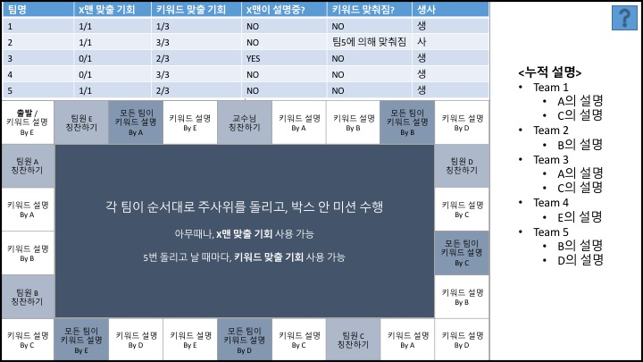

# [1] 제로 퀴즈

### How to play

- 각 팀이 돌아가면서 **사지선다형 퀴즈**를 낸다.

  > Kahoot 이용

- 이때 랜덤으로 **1~5의 숫자**가 주어진다. 

  > 혹은 정답 키워드가 주어지고, 숫자와 문제지를 내도록 할까?

- **해당 숫자 만큼의 팀이 답을 맞추도록 퀴즈를 내야 한다.** 

  - 성공할 경우

    10점을 받고, 한 번 더 퀴즈를 낼 수 있다.

  - 실패할 경우

    아무도 점수를 받지 않는다.

- **숫자가 마음에 안들면 제로 카드를 쓰고, 0명이 맞출 문제를 내면 된다.** 

  - 제로 카드를 쓸 기회는 전체 3회 뿐이다.

  - 성공할 경우

    25점을 받고, 한 번 더 퀴즈를 낼 수 있다.

  - 실패할 경우

    5점 깎인다.

- 제한 시간이 다 되었을 때 **최고 득점한 팀이 승.**

### Rules

- 문제를 애매하게 내서 심리 계산을 잘 해야 한다.
  - 숫자가 5이라고 너무 터무니없는 문제를 낼 경우, 다른 팀이 눈치를 채고 일부러 틀리게 답할 수 있다.
  - 숫자가 0이라고 너무 어려운 문제를 낼 경우, 모두 찍어서 누군가는 맞출 수 있다. 사실 모든 팀이 알지만 모든 팀이 자기 팀만 알 거라고 생각하는 문제를 내자.
- 팀 내에서만 논의가 이루어지고, 팀간 논의는 불허.
- **인터넷 검색는 오직 문제를 내고 있는 팀만 가능.**

---

# [2] 키워드 헌터

### How to Play

1. 사전작업
   - 팀별로 A~E 팀원 배정 (6명인 팀은 나와서 키워드 선정?)
   - 개별로 Keyword 조용히 확인

2. 팀당 하나의 키워드
   - 팀당 한 명은 잘못된 키워드를 아는 X맨
     - 잘못된 키워드는 실제 키워드와 유사 (예: 타코야키 - 오코노미야키)
   - **지정된 사람이 키워드 설명하는 것을 제외하고는, 절대 팀원 포함 다른 사람과 본인의 키워드에 대해 대화할 수 없음.** 
   - 다른 팀의 키워드를 맞추기 위한 논의는 얼마든지 가능
3. 애매하게 설명하기가 핵심
   - X맨 맞출 기회를 잘못 사용하지 않도록 설명을 잘 해서, 본인이 X맨이 아님을 팀원들에게 증명.
   - 동시에 다른 팀이 키워드를 맞추지 못하도록, **설명을 애매하게** 해야 함.

### Rules

- 보드게임 기반. 매팀 돌아가면서 주사위 돌리기.
  - **"키워드 설명 B"**
    - B 팀원이 키워드 설명을 해야 함.
    - 알파벳 대신 Anyone일 경우, 팀 내에서 가리키기 투표로 선정
  - **"설명 면제권"**
    - 클릭하면 랜덤 조건이 나옴 (예: 팀원 A가 B의 고향을 알아야 한다!) 만족할 경우에만 부여
    - 설명 걸렸을 때 사용 가능
- **같은 팀의 X맨을 맞출 기회 1번씩** 있음
  - 지목된 X맨은 최종변론으로 키워드 설명 1회.
  - 맞을 경우, 앞으로 키워드 설명은 오로지 X맨이 담당.

- **다른 팀의 키워드를 맞출 기회 3번씩** 있음
  - 순서의 형평성을 위해, 주사위 다섯 번 돌고 나서 맞출 기회 주어짐.
  - 맞을 경우, 맞춰진 팀은 패배.
  - 틀릴 경우, 틀린 팀에서 지목된 팀원이 키워드 설명 1회.
