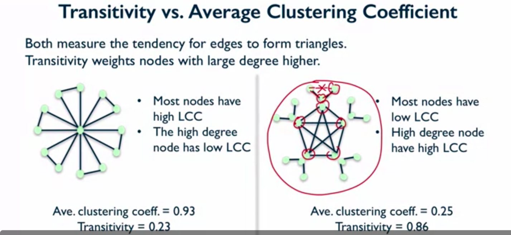

## 2. Network Connectivity

### 2.1. Clustering Coefficient

**Triadic closure**

* the tendency for people who share connections in a social network to become connected
  * ex) people who share lots of friends have an increased likelihood of becoming connected themselves

- What edges are likely to come to the network next?

  - Triadic Closure would say that those **edges that closed triangles** are good candidates for edges that may show up next

- Another way of referring to Triadic Closure is **clustering**

  

**How can we measure the prevalence of Triadic Closure in a network?** = how to measure clustering?

- motivation

  we don't always know timestamps or the ordering in which the edges come into the network

  but we want to know whether Triadic Closure is present in this network, whether it has lots of triangles or not.

- **1) Local Clustering Coefficient** of a node

  - concept: measuring clustering from the point of view of a *single node*

  - approach: **Fraction of pairs of the node's friends that are friends with each other**

  - example

    Compute the local clustering coefficient of node C:

    ```
    # of pairs of C's friends who are friends
    -----------------------------------------
    # of pairs of C's friends
    ```

    denominator

    - \# of C's friends = dc = 4 (the "degree" of C)
    - \# of pairs of C's friends = dc (dc - 1) / 2 = 12 / 2 = 6

    numerator

    - \# of pairs of C's friends who are friends = 2 (AB, EF)

    result

    = 2 / 6 = `1 / 3`

    => Local Clustering Coefficient of node C is one-third (means that one-third of all the possible pairs of friends of C who could be friends, are actually friends)

  - assumption: local clustering coefficient of a node of degree less than 2 friends is 0.

  - networkx

  ```python
  G = nx.Graph(some_input)
  nx.clustering(G, "C") # output: 0.33333
  nx.clustering(G, "J") # output: 0 by assumption
  ```

- **2) Global Clustering Coefficient** 

  - concept: measuring clustering on the *whole network*

  - approach 1: **average local clustering coefficient over all nodes in the graph**

    - example
    - networkx

    ```python
    nx.average_clustering(G) # 0.287878
    ```

  - approach 2: **percentage of "open triads" that are triangles in the network = transitivity**

    - open triads = three nodes that are connected by only two edges

    - closed triads = triangles

      (Inside each triangle, there are three open triads.)

    ```
    3 * number of closed triads
    --------------------------
    number of open triads
    ```

    - networkx

    ```python
    nx.transitivity(G) # 0.40909
    ```

  - Transitivity vs. Average Clustering Coefficient

    - 공통점: Both measure the tendency for edges to form triangles
    - 차이점: Transitivity weights nodes with large degree higher

    


| Clustering coefficient                                       |                                             |                      |
| ------------------------------------------------------------ | ------------------------------------------- | -------------------- |
| Local clustering coefficient                                 | Global clustering coefficient               |                      |
| fractions of pairs of the node's friends that are friends with each other | 1) **Average Local clustering coefficient** | 2)  **Transitivity** |
| `nx.clustering(G, "C")`                                      | `nx.average_clustering(G)`                  | `nx.transitivity(G)` |

